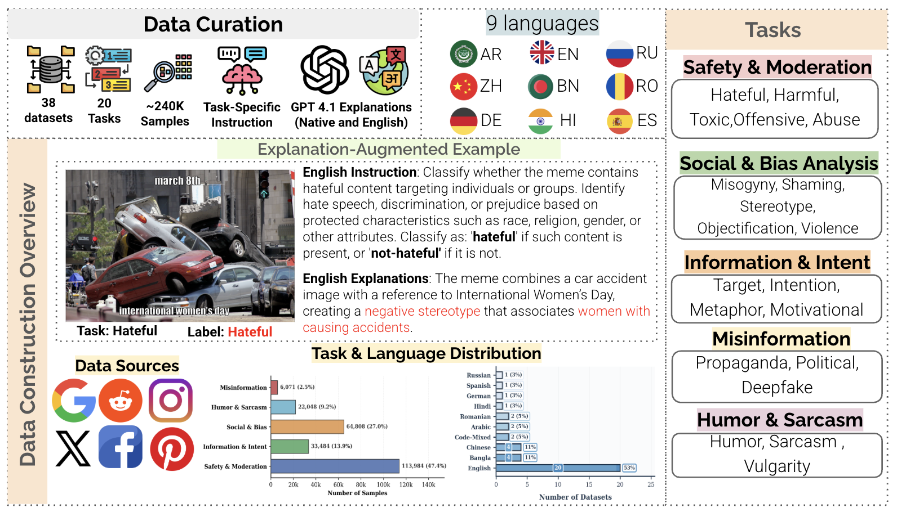
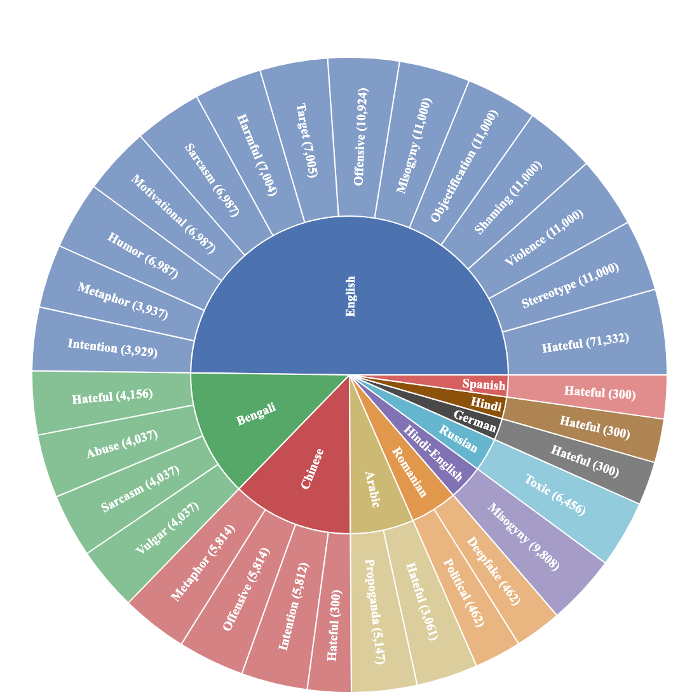

# MemeLens

**A Unified Multilingual Multitask Explanation-Enhanced Vision Language Model for Meme Understanding**

[](https://arxiv.org/abs/2601.12539)
[](https://huggingface.co/datasets/QCRI/MemeLens-VLM)
[](https://huggingface.co/QCRI/MemeLens-VLM)
[](https://creativecommons.org/licenses/by-nc/4.0/)
[](https://www.python.org/downloads/)

MemeLens consolidates **38 public meme datasets** into a unified benchmark covering **46 classification tasks** across **9 languages** (Arabic, Bengali, Chinese, English, German, Hindi, Romanian, Russian, Spanish), enriched with LLM-generated explanations and LLM-as-Judge quality scores.

<p align="center">
  
</p>

<p align="center">
  
</p>

## Table of Contents

- [Overview](#overview)
- [Quick Start](#quick-start)
- [Installation](#installation)
- [Dataset](#dataset)
- [Model](#model)
- [Full Pipeline](#full-pipeline)
  - [1. Data Preprocessing](#1-data-preprocessing)
  - [2. Explanation Generation](#2-explanation-generation)
  - [3. Instruction Dataset Creation](#3-instruction-dataset-creation)
  - [4. Data Format Conversion](#4-data-format-conversion)
  - [5. Training](#5-training)
  - [6. Inference](#6-inference)
  - [7. Evaluation](#7-evaluation)
  - [8. LLM-as-Judge](#8-llm-as-judge)
- [Repository Structure](#repository-structure)
- [Citation](#citation)

## Overview

The MemeLens pipeline consists of:

1. **Dataset Unification**: Label normalization, OCR text extraction, empty-text filtering across 38 datasets
2. **Explanation Augmentation**: GPT-4.1-generated natural language rationales for each sample (English + native language)
3. **Instruction Expansion**: Diverse task instructions via GPT-4.1 and Gemini paraphrasing
4. **Multi-Stage Training**: Stage I (classification) + Stage II (explanation generation) using LoRA on Qwen3-VL-8B
5. **Evaluation**: Classification metrics + LLM-as-Judge quality assessment (GPT-5 & Gemini-2.5-Pro)

## Quick Start

### Load the Model

```python
from transformers import Qwen2VLForConditionalGeneration, AutoProcessor
from qwen_vl_utils import process_vision_info
import torch

model = Qwen2VLForConditionalGeneration.from_pretrained(
    "QCRI/MemeLens-VLM",
    torch_dtype=torch.bfloat16,
    device_map="auto",
)
processor = AutoProcessor.from_pretrained("QCRI/MemeLens-VLM")

messages = [
    {"role": "system", "content": "You are an expert meme analyst."},
    {"role": "user", "content": [
        {"type": "image", "image": "path/to/meme.jpg"},
        {"type": "text", "text": "Analyze this meme. Is it hateful or not-hateful?\nMeme text: <OCR text here>"},
    ]},
]

text = processor.apply_chat_template(messages, tokenize=False, add_generation_prompt=True)
image_inputs, video_inputs = process_vision_info(messages)
inputs = processor(text=[text], images=image_inputs, videos=video_inputs, padding=True, return_tensors="pt").to(model.device)

output = model.generate(**inputs, max_new_tokens=512, temperature=0)
response = processor.decode(output[0][inputs.input_ids.shape[1]:], skip_special_tokens=True)
print(response)
# Label: not-hateful
# Explanation: The meme shows a lighthearted joke about...
```

Or use the demo script:

```bash
python inference/demo.py --image path/to/meme.jpg --text "meme text here"
```

### Download the Dataset

```bash
# Download everything (~88GB with images)
python data/download_dataset.py

# Download specific language(s)
python data/download_dataset.py --languages en ar

# Download specific dataset(s)
python data/download_dataset.py --datasets Hateful_en_FHM abuse_bn__BanglaAbuseMeme

# List available datasets
python data/download_dataset.py --list
```

## Installation

### Prerequisites

- Linux (tested on Ubuntu 20.04/22.04)
- Python 3.10
- CUDA 12.x with a compatible GPU (training requires 4x H200/A100; inference works on a single GPU with >= 24GB VRAM)
- [Conda](https://docs.conda.io/en/latest/miniconda.html) (recommended) or pip

### Setting Up the Environment

**1. Clone the repository:**

```bash
git clone https://github.com/QCRI/MemeLens.git
cd MemeLens
```

**2. Create and activate a Conda environment:**

```bash
conda create -n memelens python=3.10 -y
conda activate memelens
```

**3. Install PyTorch (CUDA 12.x):**

```bash
pip install torch==2.8.0 torchvision==0.23.0 --index-url https://download.pytorch.org/whl/cu124
```

**4. Install project dependencies:**

```bash
pip install -r requirements.txt
```

**5. Install FlashAttention (recommended for faster training/inference):**

```bash
pip install flash-attn==2.8.3 --no-build-isolation
```

**6. For training, install MS-Swift:**

```bash
pip install ms-swift[llm]>=3.10.0
```

### Verified Package Versions

The following versions have been tested and confirmed to work together:

| Package | Version |
|---------|---------|
| Python | 3.10 |
| torch | 2.8.0 |
| torchvision | 0.23.0 |
| transformers | 4.57.1 |
| accelerate | 1.10.1 |
| peft | 0.17.1 |
| ms-swift | 3.10.0 |
| vllm | 0.11.0 |
| datasets | 3.6.0 |
| deepspeed | 0.18.1 |
| flash-attn | 2.8.3 |
| scikit-learn | 1.7.2 |
| qwen-vl-utils | 0.0.14 |
| pandas | 2.3.3 |
| numpy | 2.1.2 |
| Pillow | 11.3.0 |

## Dataset

**HuggingFace**: [QCRI/MemeLens-VLM](https://huggingface.co/datasets/QCRI/MemeLens-VLM)

| Statistic | Value |
|-----------|-------|
| Total samples | 271,835 |
| Tasks | 46 |
| Languages | 9 (ar, bn, de, en, es, hi, ro, ru, zh) |
| Splits | train / test / val |

### Dataset Fields

**All splits:** `id`, `image`, `text`, `label`, `task_description`, `explanation`, `native_label`, `native_task_description`, `native_explanation`

**Test split (LLM-as-Judge):** `informativeness`, `clarity`, `plausibility`, `faithfulness` (1-5 avg from GPT-5 & Gemini-2.5-Pro), `llm_judge` (per-model scores & justifications)

## Model

**HuggingFace**: [QCRI/MemeLens-VLM](https://huggingface.co/QCRI/MemeLens-VLM)

- **Base model**: Qwen3-VL-8B-Instruct
- **Fine-tuning**: LoRA (rank=16, alpha=32) on all linear layers
- **Training**: Multi-stage (Stage I: classification, Stage II: explanation generation)
- **Output format**: `Label: <class_label>\nExplanation: <rationale>`

## Full Pipeline

### 1. Data Preprocessing

#### OCR Text Extraction
For datasets without embedded text, extract text using EasyOCR:
```bash
python data/preprocessing/ocr_extraction.py \
    --input_file dataset.jsonl \
    --output_file dataset_with_text.jsonl \
    --languages en ar
```

#### Label Unification
Normalize labels across all datasets into canonical forms:
```bash
python data/preprocessing/unify_labels.py
```
Maps variants like `no_harmful`, `not_harmful`, `non-hateful` into standardized labels (e.g., `not-hateful`).

#### Empty Text Filtering
Remove samples without embedded text:
```bash
python data/preprocessing/filter_empty_text.py
```

#### Dataset Statistics
```bash
python data/preprocessing/generate_dataset_statistics.py
```

### 2. Explanation Generation

Generate natural language explanations using GPT-4.1 via Azure Batch API:

```bash
# Full pipeline
cd explanations
bash run_pipeline.sh

# Or step-by-step:
bash run_pipeline.sh generate   # Generate batch files
bash run_pipeline.sh submit     # Submit to Azure
bash run_pipeline.sh status     # Check status
bash run_pipeline.sh download   # Download results
bash run_pipeline.sh merge      # Merge with datasets
```

Requires Azure OpenAI API credentials in an `.env` file. See `explanations/config.py` for dataset configuration and `explanations/task_definitions.json` for task-specific prompts.

### 3. Instruction Dataset Creation

Expand seed instructions using GPT-4.1 and Gemini:

```bash
# Generate 10 diverse instruction variants per dataset using GPT-4.1
python instructions/expand_instructions_gpt.py

# Generate 10 variants using Gemini
python instructions/expand_instructions_gemini.py

# Add native language labels
python instructions/add_native_labels.py

# Append instructions to all dataset samples
python instructions/append_instructions_to_datasets.py
```

### 4. Data Format Conversion

Convert datasets to MS-Swift training formats:

```bash
# Sequence classification format (per-dataset heads)
python training/format_conversion/convert_seq_cls.py

# Instruction-following with explanations (3 variants)
python training/format_conversion/convert_with_explanations.py
```

Supported explanation formats:
- **classify_then_explain**: `Label: <label>\nExplanation: <explanation>`
- **explain_then_classify**: `Explanation: <explanation>\nLabel: <label>`
- **input_augmented**: Explanation in input, label in output

### 5. Training

#### Unimodal Baselines

```bash
# Text-only (BERT multilingual)
python training/baselines/train_text_bert.py \
    --train_file data/dataset/train.jsonl \
    --val_file data/dataset/val.jsonl \
    --model_name bert-base-multilingual-cased \
    --output_dir ./output/text_baseline

# Image-only (ViT)
python training/baselines/train_image_vit.py \
    --train_file data/dataset/train.jsonl \
    --val_file data/dataset/val.jsonl \
    --model_name google/vit-base-patch16-224 \
    --output_dir ./output/image_baseline
```

#### Multimodal Sequence Classification (per-dataset)

Generate and run per-dataset training scripts:
```bash
# Generate training scripts for all 43 datasets
python training/seq_cls/generate_train_scripts.py

# Train a single dataset
bash training/seq_cls/train_<dataset_name>.sh
```

Uses Qwen3-VL-8B-Instruct with LoRA, trained separately per dataset for 5-20 epochs.

#### MemeLens Multi-Stage Training

**Stage I** - Classification (3 epochs, lr=1e-4):
```bash
bash training/memelens/train_stage1_classification.sh
```

**Stage II** - Explanation generation (6 epochs, lr=1e-5, from Stage I checkpoint):
```bash
bash training/memelens/train_stage2_explanation.sh
```

Training configuration:
- **Model**: Qwen3-VL-8B-Instruct
- **LoRA**: rank=16, alpha=32, dropout=0.05, all linear layers
- **Optimizer**: AdamW with cosine scheduling, 5% warmup
- **GPUs**: 4x H200/A100, bfloat16 precision
- **Framework**: [MS-Swift](https://github.com/modelscope/ms-swift)

#### Adapter Merging

Merge LoRA adapters from multiple training stages using TIES, DARE, or linear methods:
```bash
# Merge LoRA into base model
bash training/adapter_merging/merge_lora.sh <adapter_path> <output_dir>

# Merge multiple adapters (TIES method)
bash training/adapter_merging/merge_adapters.sh
```

### 6. Inference

#### MemeLens (classify + explain)
```bash
bash inference/run_memelens.sh
```

#### Zero-Shot Evaluation
```bash
bash inference/run_zero_shot.sh
```
Supports: Qwen3-VL-8B, GPT-4.1, Gemma-3-12B, InternVL3.5-8B, Phi-3.5-Vision, Llama-3.2-Vision.

#### Single Model Demo
```bash
python inference/demo.py --image meme.jpg --text "meme OCR text"
```

### 7. Evaluation

Compute classification metrics (accuracy, macro-F1, weighted-F1, per-class metrics):
```bash
python evaluation/compute_metrics.py \
    --data results/predictions.jsonl \
    --out_dir scores/dataset_name/

# Score all results at once
bash evaluation/score_all.sh

# Generate Excel summary across all datasets
python evaluation/generate_summary.py
```

### 8. LLM-as-Judge

Evaluate explanation quality using GPT-5 and Gemini-2.5-Pro on 4 criteria (1-5 scale):
- **Informativeness**: Uses salient visual/textual cues
- **Clarity**: Logically traceable from content to label
- **Plausibility**: Sound, defensible interpretation
- **Faithfulness**: Grounded in observable content

#### GPT-5 Judge
```bash
# Direct evaluation (async parallel)
python llm_judge/gpt5/run_judge_full.py

# Or via batch API
python llm_judge/gpt5/submit_batches.py
python llm_judge/gpt5/retrieve_results.py
python llm_judge/gpt5/merge_results.py
```

#### Gemini-2.5-Pro Judge
```bash
python llm_judge/gemini/batch_submit.py
python llm_judge/gemini/batch_retrieve.py
python llm_judge/gemini/batch_merge.py
```

#### Aggregate Scores
```bash
python llm_judge/compute_final_summary.py
```

## Repository Structure

```
.
├── README.md
├── requirements.txt
├── assets/                                # Figures and diagrams
├── configs/
│   └── slurm_template.sh                 # SLURM job template (H200/A100)
├── data/
│   ├── download_dataset.py                # Download from HuggingFace
│   └── preprocessing/
│       ├── unify_labels.py                # Label normalization
│       ├── filter_empty_text.py           # Remove empty-text samples
│       ├── ocr_extraction.py              # EasyOCR text extraction
│       └── generate_dataset_statistics.py
├── explanations/
│   ├── run_pipeline.sh                    # Full explanation pipeline
│   ├── generate_explanations.py           # GPT-4.1 batch generation
│   ├── submit_batches.py
│   ├── retrieve_results.py
│   ├── retrieve_and_parse.py
│   ├── merge_results.py                   # Merge into datasets
│   ├── batch_processor.py                 # Azure batch API handler
│   ├── config.py                          # Dataset configurations
│   └── task_definitions.json              # Task-specific prompts
├── instructions/
│   ├── expand_instructions_gpt.py         # GPT-4.1 instruction expansion
│   ├── expand_instructions_gemini.py      # Gemini instruction expansion
│   ├── add_native_labels.py               # Native language labels
│   └── append_instructions_to_datasets.py
├── training/
│   ├── format_conversion/
│   │   ├── convert_seq_cls.py             # Seq classification format
│   │   └── convert_with_explanations.py   # Explanation formats
│   ├── baselines/
│   │   ├── train_text_bert.py             # BERT multilingual baseline
│   │   └── train_image_vit.py             # ViT baseline
│   ├── seq_cls/
│   │   └── generate_train_scripts.py      # Per-dataset training scripts
│   ├── memelens/
│   │   ├── train_stage1_classification.sh # Stage I: classification
│   │   └── train_stage2_explanation.sh    # Stage II: explanation
│   └── adapter_merging/
│       ├── merge_adapters.py              # TIES/DARE/Linear merging
│       ├── merge_adapters.sh
│       └── merge_lora.sh
├── inference/
│   ├── demo.py                            # Quick inference demo
│   ├── run_memelens.sh                    # Full MemeLens inference
│   ├── run_zero_shot.sh                   # Zero-shot evaluation
│   └── merge_explanations_into_results.py
├── evaluation/
│   ├── compute_metrics.py                 # F1, accuracy, confusion matrix
│   ├── generate_summary.py                # Excel summary across datasets
│   └── score_all.sh                       # Score all results
└── llm_judge/
    ├── compute_final_summary.py           # Aggregate GPT-5 + Gemini scores
    ├── gpt5/
    │   ├── run_judge_full.py              # Async parallel evaluation
    │   ├── submit_batches.py
    │   ├── retrieve_results.py
    │   ├── merge_results.py
    │   ├── prepare_samples.py
    │   └── batch_processor.py
    └── gemini/
        ├── batch_submit.py
        ├── batch_retrieve.py
        ├── batch_merge.py
        ├── check_status.py
        └── prepare_samples.py
```

## Citation

```bibtex
@article{memelens2025,
  title={MemeLens: A Multimodal, Multilingual Benchmark for Meme Understanding},
  author={Shahraur, Ali and Bayan, Mohamed and others},
  journal={arXiv preprint arXiv:2601.12539},
  year={2025}
}
```

## License

CC-BY-NC-4.0

## Related

- **Dataset (classification only)**: [QCRI/MemeLens](https://huggingface.co/datasets/QCRI/MemeLens)
- **Dataset (with explanations + judge scores)**: [QCRI/MemeLens-VLM](https://huggingface.co/datasets/QCRI/MemeLens-VLM)
- **Model**: [QCRI/MemeLens-VLM](https://huggingface.co/QCRI/MemeLens-VLM)
- **Paper**: [arXiv:2601.12539](https://arxiv.org/abs/2601.12539)
